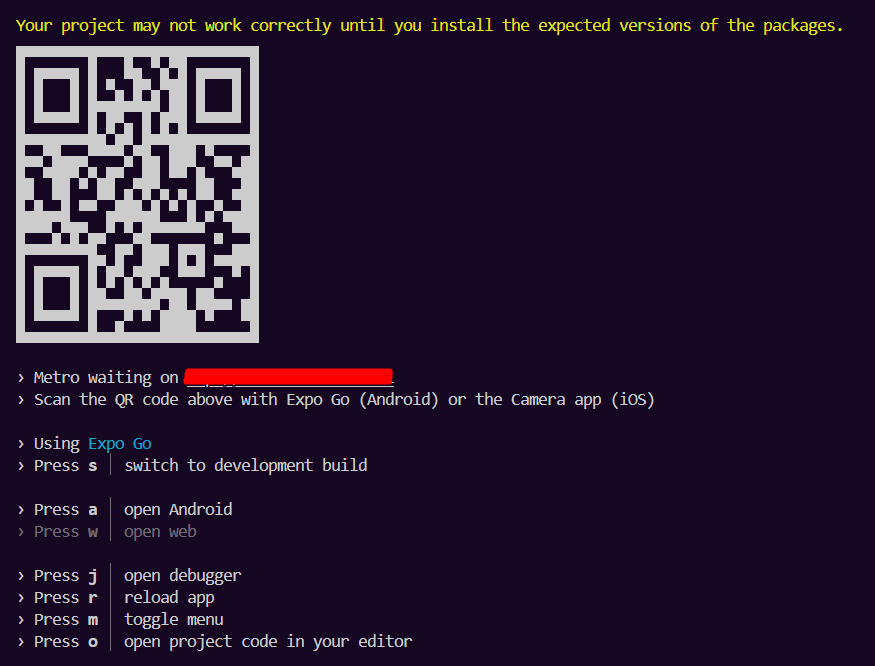

# My-List React Native
Meu estudo em React Native + EXPO

## Clonando o Repositório

```bash
git clone https://github.com/Allan-Wariss/App-React-Native
```

## Depedências & Como iniciar

Baixa todas de uma vez.
```bash
npm install
```
Caso a primeira não funcione, baixe separado.
```bash
npm i react-native-vector-icons
npm install -g expo-cli
```

Inciar
```bash
npx expo start
```
-Baixe o APP EXPO GO (IOS/ANDROID).

-Ao iniciar o projeto no seu terminal, leia o QR CODE com seu celular.

-Seu computador e celular devem estar na mesma REDE.




## Links Pessoais

- [Perfil no GitHub](https://github.com/Allan-Wariss)
- [Perfil no LinkedIn](https://www.linkedin.com/in/allan-feitosa-wariss-maia/)
